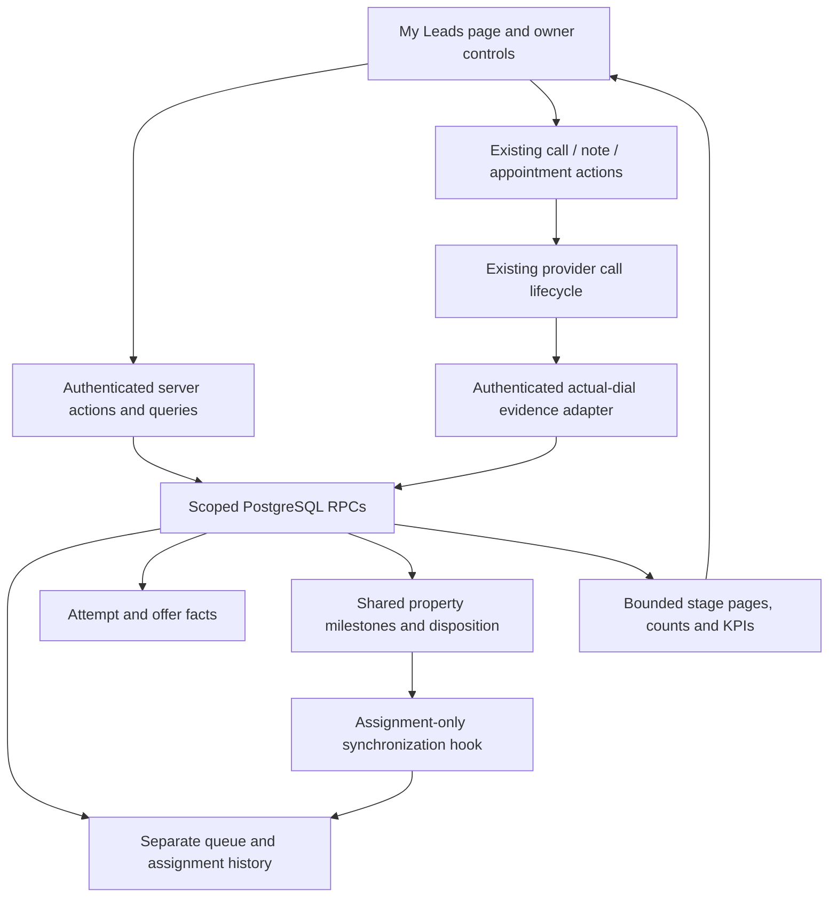

# My Leads — modular technical implementation plan

**Status: implementation and core local acceptance passed; hosted CI and release gates remain. See [acceptance evidence](plan/ACCEPTANCE-RECEIPT.md).**

Product authority: [PRD v0.2](PRD.md). Technical contract authority: [CONTRACTS.md](CONTRACTS.md). Exact baseline: Sandra main `8c7053e7024433f46791eac1b186c1b7a7cf10ec`, verified against GitHub on September 11, 2026. The main-folder checkout is an older June branch and must not be used as the implementation baseline.

## 1. Read this first

The feature is feasible with additive data and an isolated route. Most work is ordinary queue/forms/query work. The important integration work is (a) durable actual-call evidence, (b) preserving assignment and performer history, and (c) atomic milestone/handoff writes that do not bypass existing lead guards.

Do not execute the original BUILD-PROMPT. It conflicts with the interview on global statuses, six sections, mandatory appointments, recordings, timers, offer sending, owner inspection and legacy timing. The PRD governs visual/behavioral discrepancies until the static mockup is updated. A separate mockup rewrite is not a prerequisite to implementing the approved behavior.

The plan is split into packets that Luna can execute with explicit ownership, inputs, steps, tests and completion evidence. Packet names are local implementation units, not permission to create new Codex tasks, new feature owners, provider operations or shared DB reservations. Jarrad superseded the original coordination clause: this task executes independently with built-in agents and must not use or depend on the Sandra Orchestrator, Messenger, or controller.

## 2. Proposed architecture

- Reuse `properties` and existing membership/access, roster, notes, task/appointment, softphone and event-history contracts.
- Keep queue stage independent of property status. Explicit My Leads milestones update shared status; a generic board-status change does not become a queue transition.
- Observe assignment changes centrally so all existing assignment surfaces maintain episodes. Observe only the necessary assignment contract, not every property mutation.
- Make business-changing commands transactional, version-checked and idempotent. Keep external provider network requests outside SQL transactions.
- Store performer/event time and assignment-period references. Do not derive historic credit by joining to the current assignee.
- Initial render uses a bounded server snapshot with five independent stage pages, counts and aggregates. Expanded detail is separate and paginated. The badge uses a tiny signed-in-user count query.
- Reuse `src/lib/time/zoned.ts`; no new timezone package or background job is needed for warnings. Derive first-call working-time deadlines and current warning state at query time, and let the client refresh from server time.
- Acquisitions designation changes live in a same-org owner control inside My Leads. Do not broaden `admin/users`, which is currently admin-email-gated and globally inventories Auth users.

## 3. Scope locks for every packet

1. Five labels: Not contacted, Contacted, Needs offer / Interested, Offer Sent, Under Contract.
2. No global attempted status and no blanket reverse synchronization.
3. Actual initiation, not dialog open or preparation time, stops the first-call clock. Non-call outreach does not stop it.
4. Motivation response required; No motivation provided is accepted and separate from temperature.
5. No appointment prerequisite for qualification, offer or contract. No automatic task/calendar creation.
6. Offer log only, required follow-up instant, no eSign send.
7. Needs sequence + verified Jarrad reassignment on nurture handoff. Decline additionally records Offer Declined. No sequence enrollment.
8. Current stale count independent of KPI range. First-call warning 30 working minutes M–F09–17 America/Chicago; offer-needed warning 12 elapsed hours.
9. Existing Maria cohort gets Contacted or retains later milestones; initial episodes excluded from first-call timing. No invented calls or assignment dates.
10. Under Contract remains until deliberate archive; access roles unchanged; original rep keeps activity credit.

## 4. Research and evidence

- [Data and security research](research/DATA-AND-SECURITY.md): schema/constraints, RLS, assignment and handoff transactions, migration boundaries.
- [Call and workflow research](research/CALLS-AND-WORKFLOWS.md): Sandra/Jitter/Telnyx lifecycle, provider identity/dedupe, appointments and notes, pending PR overlaps.
- [UI, KPI and time research](research/UI-KPIS-AND-TIME.md): version-specific framework guidance, existing seams, time functions, scoped read models.
- [Research and review receipt](plan/REVIEW.md): independent findings, corrections and document verification.
- [Test and release contract](plan/TEST-AND-RELEASE.md): actual test selectors, fixture budget, boundary cases, review/admission/release protocol.

Research proposals are advisory. When a research memo offers alternatives or differs in names or interfaces, use CONTRACTS.md and the packet, not an arbitrary mixture. Implementation changes to the frozen contract must be reconciled before dependent packets proceed.

## 5. Existing code ownership and open PRs

The September 11 read-only GitHub census still shows:

| PR | Relevant scope | Treatment |
|---|---|---|
| #519 | Pre-call setup; shared softphone provider/button | Coordinate call entry and evidence hook with owner. Use reviewed API; no copying unreviewed branch code. |
| #522 | Softphone recovery retention | Preserve call identity and recovery through new evidence integration. |
| #492 | Transport terminal polling | Avoid changing terminal behavior. Overlap is not proof this feature depends on the PR. |
| #520 | Messages Mine assignment/status filtering | Preserve assignment semantics; assignment observer must cover its existing writes. |
| #514 / #518 | Leads/Messages performance | Reuse bounded query ideas without requiring this unrelated performance work as a blanket prerequisite. |
| #521 | Conversation switching/refresh | New page owns its state; do not alter broad Messages refresh code. |
| #516 / #517 | Sequence delivery and fixtures | No sequence runtime change required for Needs sequence disposition. |

At execution, refresh main and open PR heads, compare changed paths and semantic contracts. Declare actual dependencies on every PR. Stack on an unmerged reviewed dependency when required by repository policy. File overlap requires agreement; it does not automatically force all these PRs into a dependency chain.

Do not assign integration work to historical/archived sessions or start a new controller. Orchestrator remains the feature-dispatch owner; Tester and Merge Controller retain their current authorities.

## 6. Packet execution

Start with the [15-packet index and dependency waves](plan/PACKETS.md). Each linked packet includes exact owned paths, implementation steps, test selectors, completion evidence and boundaries.

## 7. Luna execution discipline

For one packet, read PRD, CONTRACTS, that packet, AGENTS, and only the listed reference code. Work in the assigned isolated worktree. Implement only owned files plus explicitly permitted type/test updates. Do not discover and fix unrelated defects.

Before touching a shared file, confirm its owner and parent/head. If the contract is available but an unrelated shared-test job is busy, continue local code, unit/RTL checks and review preparation. Hold only the operation actually requiring admission.

Each packet returns: owned paths and diff summary; exact head/base and dirty state; decisions/contract deviations; tests run with results and discovered counts; tests not run and why; migration/provider effects; remaining dependencies; next packet readiness. Do not label a mock or unit result as end-to-end proof.

Use the existing reviewed TypeScript types as the consumer boundary. No consumer packet silently renames database enums or RPC fields. Call/provider integration stays in one packet owner. New migration files receive final timestamp ordering during implementation; never invent a previously applied migration identity.

## 8. What the research does not prove

This plan does not establish production database contents, migration state, provider deployment identity, recording delivery, an existing test reservation, or account availability. Those are explicit baseline/admission checks in the relevant packet, not reasons to perform speculative production work during planning.

The source-to-provider actual-dial mapping must be evidenced before the call packet can pass. A successful session-provisioning response alone is not accepted as proof. The remaining packets can be developed against the frozen actual-dial event contract while that integration proof is completed.

No product code, migrations, provider calls, test users or deployments were executed to produce this plan. Verification here means document consistency and code/documentation research, not running the feature.
