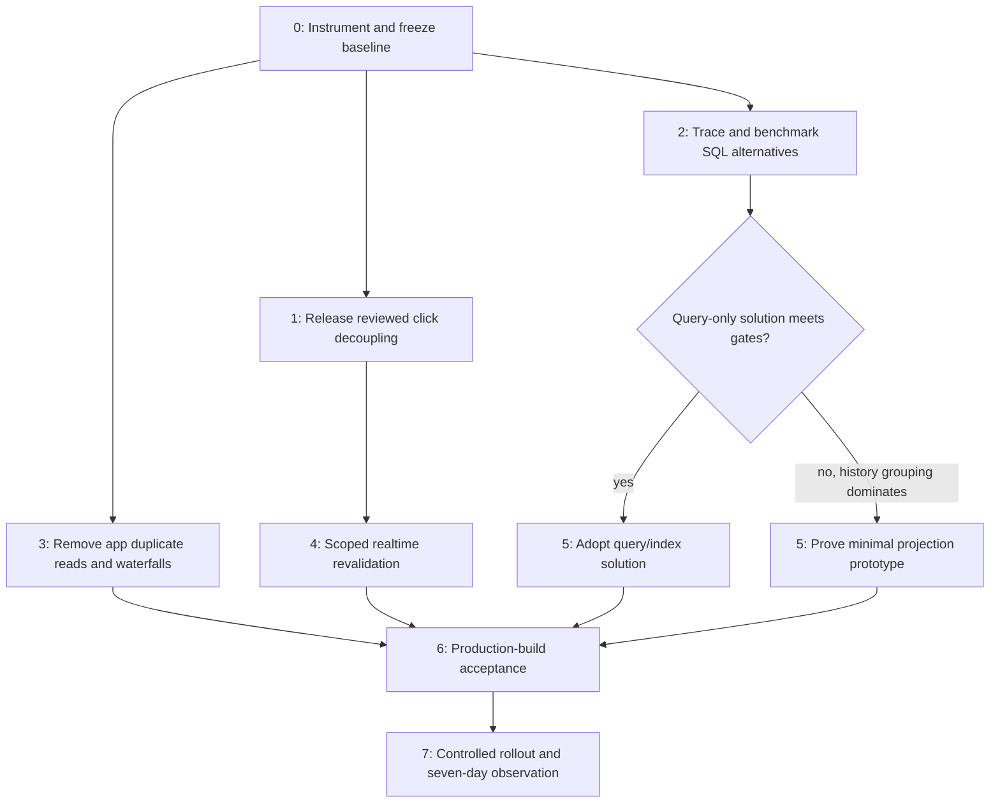

# Sustained Messages and Leads latency: technical plan

Status: approved technical plan — Fable5.1 Medium returned DONE with high confidence after3 planning rounds on September10,2026. Planning only; no new product/schema changes or deployment in this task.

## Goal, baseline and scope

Make Messages selection, Messages entry/filtering, lead detail and Leads board stay responsive under representative data volume and message activity for seven days. Do not solve speed by serving stale safety decisions or losing inbox behavior.

Code baseline: reviewed PR514 `cbf022f5a814615b7d4d1c23c33ef4bf311854ac`; investigation branch `codex/inbox-sustained-performance` includes diagnostic commit `a685af5f`. PR514 is still open at planning time. Any dependent PR must target its branch until the dependency lands; recheck live PR state before creation/merge. No code from unreviewed PR418 or another branch is assumed.

Measured baseline, not percentiles: message click→detail DOM3618ms (RSC3367.7ms), lead detail2476.4ms, Leads board956.2ms. Default inbox SQL previously2783.1ms with797900 buffer hits and13946 temporary blocks. Current cumulative query entries average2576.9/3800.1ms. These observations establish expensive work, not a24-hour regression mechanism or CPU-only bottleneck.

Three read-only agent lanes reviewed database semantics/write paths, application dependencies/refreshes, and measurement/deployment. Provider sources and installed versions are recorded below. The final plan must be challenged by Fable5.1 Medium and independently adjudicated by Codex.

## Decisions

1. Instrument actual requests and events, preserve measurements through rollout, and separate deployment versions and cold/warm states.
2. Release PR514 only after its existing code/CI/browser/release gates. It removes awaited work from local message clicks and streams imagery; it does not fix the recurring aggregate or all refresh paths.
3. Remove verified duplicate reads, true waterfalls and full-route event invalidation. Run query-plan experiments alongside this application work.
4. Preserve exact counts, cutoff/search behavior, authoritative safety and single-snapshot page/count consistency by default. A stale-count UX is a separate product decision, not a hidden optimization.
5. Select the least complex query/index change meeting the sustained targets. A minimal maintained message-facts projection is conditional on experiments; a fully denormalized inbox is not the starting design.
6. Keep source ingestion reliability and tenant isolation as hard gates. Do not silently swallow projection failures and continue serving stale results.
7. Do not add Redis, read replicas, a global memory increase, a long-lived inbox cache, or a Google metadata cache project without measured need.

## Work packages and dependency graph

Independent work packages may execute concurrently; their shared database/browser tests remain serialized. No production-scale benchmark loops run against production.

### 0 — Instrumentation and reproducible baseline

Owners: observability/application, with database reviewer.

Files: new `src/instrumentation.ts` and a small shared timing utility; `messages/page.tsx`, `inbox-detail-data.ts`, `use-conversation-selection.ts`, `inbox-detail.tsx`, `use-throttled-refresh.ts`, `use-queue-stats.ts`; lead loaders and `lib/auth/team-roster.ts`. Validate installed Next16.2.4 instrumentation support before selecting an OTel dependency/exporter. Existing diagnostic SQL is `scripts/performance/inbox-latency-snapshot.sql`.

Capture content-free spans: middleware/session/membership, canonicalization, inbox RPC by filter class, unknown counts/list, queue metrics, roster membership/Auth page count, detail org/messages/contact/safety, lead ancillary groups, board stages/counts/decorations, imagery metadata/cache outcome. Correlate route class, deployment SHA, request/action ID, status, duration, rows/bytes and trigger reason. Never log message body, address, names, phone, auth token, raw SQL or raw query strings; avoid identifying tenant/user dimensions unless hashed and necessary.

Browser actions measure click→feedback, click→correct usable content, network completion, long tasks and actual presentation where supported. DOM readiness and screen paint remain separate labels. Record abort/error/cancel outcomes; do not count skeleton appearance as completed content. Capture refresh reason (click/event/focus/reconnect), in-flight count and coalesced work. Count actual requests, not calls to helper functions.

Record Vercel function region AND Supabase database region for matched requests, plus deployment/runtime, duration, initialization and concurrency evidence if available on the account. Before freezing click budgets, verify deployed region placement; if they differ, compare supported colocated deployment in test and document the placement decision and residency constraints. Do not assert network latency from geographic labels alone. Do not enable a paid exporter/plan without a scoped decision. Prefer @vercel/otel after installed-version and account verification. Review automatic outbound-fetch span attributes as well as custom logs: strip URL queries, Google keys/signatures, bodies and credentials. Start with supported tracing/structured logs and bounded synthetic collection; passive diagnostic counters remain available. Capture existing permitted host metrics at approximately 1 minute and statement deltas at 5 minutes during evaluation, withat least 14-day retained exports; if no collector/retention is available, build a bounded content-free export first. Six-hour heartbeat sampling is only coarse baseline support, not the full acceptance instrumentation.

Freeze a synthetic dataset with at least the larger of55,000 conversations or the then-current production count (record the count/date), realistic messages-per-thread distribution,90-day and365-day boundaries, unread skew, old review-only work, high/low selectivity search, assignment/noise mix, timestamp ties and multi-org cases. Use production build, not Next dev, for performance tests. Compare1,3 and10 concurrent readers plus controlled synthetic message updates in isolated test infrastructure. Reuse repo leases/isolation; never use CI identities while shared CI can mutate them.

Exit: request and DB costs can be correlated; baseline distributions and test parameters recorded; zero content/secrets in retained telemetry; timing overhead measured and bounded. Six-hour database counters continue for seven days but do not produce p95 on their own.

### 1 — Reviewed PR514 release boundary

Recheck exact head, manual/Fable approval, all required checks, preview authentication and browser outcome proof. Record schema/backend and deployed SHA; a Vercel preview pass is not production deployment. Keep this package separately reviewable. Do not relabel its local detail GET as elimination of all background inbox work.

### 2 — Actual-plan SQL experiments before schema selection

Files: latest definition in `supabase/migrations/20260909080000_messages_search.sql`, `src/lib/messages/list-threads.ts`, existing inbox/search integration tests; add isolated benchmark/parity harness and future migration only after selection.

Use actual installed production-equivalent function body (verified hash `5bfab134887e615681f6df65c5edf889`) and authenticated membership/RLS, not only service role. Extract inner query-node EXPLAIN ANALYZE BUFFERS, loops, rows, spill shape and timing. Parameter matrix: all/unread/mine/unassigned/escalated/dispo/needs_outcome; hide-noise on/off; default90 days and edge cutoffs; selected-read unread exception; first/deep/clamped page; empty/common/selective text and phone searches; single/multi-org.

Compare one variable at a time:

- current plan versus selective CTE inlining, latest-row DISTINCT ON/lateral source-index rewrite;
- current consent lookup versus `(org_id, contact_id, occurred_at DESC, id DESC)` partial meaningful-SMS-event index with optional included event type;
- unread source aggregation versus indexed per-candidate probes, including all eligibility predicates;
- candidate-first indexed search IDs versus the current correlated OR/EXISTS; preserve all-history/queued message search semantics;
- bounded transaction-local work_mem experiment on isolated production-scale data (e.g.5/16/32MiB), with concurrent-reader memory assessment. Do not change global settings. Buffers alone do not establish CPU saturation or rule out indexing; track_io_timing is currently off.

Record actual use of the already-existing trigram and GIN indexes in every search comparison; never benchmark against an assumed absence. Keep only indexes actually adopted with measurable benefit and acceptable write/size cost. Concurrent index creation has separate transaction/workflow requirements; choose the established migration-safe method, not a command that cannot run in its enclosing transaction.

Exit decision: if exact same-snapshot counts are the dominant remaining cost after the best query-only candidate, present the measured cost of exactness and explicit consistency alternatives to the product owner BEFORE choosing a projection to preserve that cost. Keep the exact contract unless the user changes it. Continue independent application fixes while that product question is pending. If query-only meets DB and correctness gates, retain it and omit projection. If live consent/classification dominates, a message-facts projection is unlikely to solve that dominant cost; redesign that measured subproblem before approval. If history reconstruction remains dominant and misses targets, proceed to conditional package5. Splitting UI resources does not authorize inconsistent row/count snapshots.

### 3 — Remove duplicate application work and genuine waterfalls

**Selected conversation detail:** optimize `inbox-detail-data.ts` and the detail API as an explicit work item. Trace actual serial hops (including internal org resolver calls), then move independent consent/suppression reads alongside contact/property/source-message reads once authorized org, contact ID and authoritative message route are known. Preserve null-contact, read-failure and saved-phone semantics. Keep the API authentication-before-data admission boundary by default; do not blindly parallelize it because calls look independent. Request-local validated auth reuse or a narrower combined authorized RPC is conditional on security tests. Add call-order/concurrency tests and measured hop/request counts; do not promise an unverified five-to-three-hop reduction.

**Roster:** `leads/page.tsx:61–70` loads historical-inclusive and active rosters separately; `lib/auth/team-roster.ts:27–80` can enumerate global Auth users25×200 per lookup. Read one scoped inclusive roster per org and derive active options, preserving historical display-only labels and current membership checks. Share request-local reads via a module-scope React cache wrapper with stable primitive arguments in Server Components; explicitly dedupe in route handlers/actions. First use targeted existing identity lookup or synchronization if available; if a new label projection is needed, specify authoritative update/deletion/rename/reconciliation semantics before adoption. Never cache access eligibility in a display profile. Goal: no global Auth listUsers in normal page rendering.

**Lead dependency graph:** after authorized lead/DNC branch, start independent notes/events/tags/calls/eSign/neighbors/roster/template reads with bounded concurrency. `smsConsentEventsPromise` and `openWorkPromise` are lazy PostgREST builders; naming them promises does not start fetch. Convert each once to an eagerly consumed native promise/Promise.all and reuse it; awaiting a builder twice can duplicate requests. Keep dependencies such as required mark-read→snapshot ordering until proved replaceable. Keep safety unresolved→disabled/fail-closed behavior.

Stream slow ancillary sections outside stable form/draft shells. Investigate duplicate metadata/page property reads and wide recording/transcript payloads only after tracing quantifies wire/payload cost. Match projection and auth semantics before deduplication. Retain streamed imagery; do not wait for image metadata to enable core controls. Google permits persistent panorama IDs, not unrestricted storage of every metadata field; keep original source-owned location and refresh invalid pano IDs if such caching is later justified.

Tests: provider request count, inactive/deleted/historical identities, multi-org privacy, error behavior, input focus/drafts across independent section resolution, safety failure ordering, no duplicate builder execution.

### 4 — Scoped realtime resources, not full-route reloads

Files: `messages/inbox-detail.tsx:586–633`, `inbox-thread-list.tsx:80–138`, `use-conversation-selection.ts`, `use-queue-stats.ts`, `use-throttled-refresh.ts`, `messages/page.tsx`; bounded authenticated resource endpoint(s) following existing detail endpoint conventions.

The detail panel has direct unthrottled router.refresh paths outside the list's10-second throttle. Add explicit `revalidateSelectedDetail` distinct from `select` (same-thread select intentionally short-circuits to preserve a draft). It must preserve `replyRefreshGate`, abort/generation handling and current selection identity. Only matching fresh authoritative safety data may unlock reply; optimistic event contents must never do so.

List invalidation fetches active page plus exact counts in one authoritative snapshot; it does not reload roster/queue/unknown inventory. Unknown/dismissed rows are paginated and fetched only for their view; normal inbox needs only appropriate counts. Queue polling becomes separately owned, visible-only, one request in flight, with one trailing dirty refresh.

Each resource gets one in-flight request, a dirty bit for one coalesced follow-up, cancellation/selection generation, error/retry behavior, and visibility/reconnect reconciliation. Narrow org/conversation event filters where supported and correct. Absence of an explicit subscription org filter does NOT prove cross-tenant events bypass RLS. Preserve authorization and evaluate the actual delivered event set.

Invalidate correctly for message changes, assignment/property linkage, responder/review state, contact opt-out, phone suppression and expiring access. Do not assume current message-only subscriptions cover all sources. Keep bounded authoritative focus/reconnect reconciliation for missed events; dedupe with event requests. No fixed “one per10s” safety delay is imposed on STOP/current selected-detail changes.

Cross-tab/cross-user decision: defer shared-cache/leader-tab infrastructure initially, but measure it explicitly. Escalate to an org-scoped change-version/single-flight design review if refreshes exceed2 per foreground action AND consume>50% of inbox SQL execution over a representative30-minute activity window, OR the10-reader synthetic test misses budgets after per-resource changes. With no foreground actions, use the execution-share and budget criteria rather than divide by zero. These trigger thresholds are frozen before comparison. Package4 cannot pass sustained load acceptance merely by renaming route refreshes as resource requests; total SQL work per action/minute must improve. Do not share authenticated results across users without proving membership/filter/safety boundaries.

Tests: burst INSERT/UPDATE, inbound STOP, terminal/failed outbound events, replyRefreshGate release, event during initial load, old response after newer selection, same-thread draft preservation, hidden→visible, disconnect/reconnect, cross-tab updates, membership expiry, all safety-source mutations with explicit fixtures for `consent_events`, `sms_phone_suppressions`, `contacts`, `properties`, `message_threads` responder state and `ai_disposition_reviews`. Verify zero whole-route rebuilds on selected-detail events and zero inbox/roster/unknown work on ordinary local selection.

### 5 — Conditional minimal message-facts projection

Only implement if package2 proves it is needed and the concurrency protocol is demonstrated correct.

One row per `(org_id, conversation_id)` stores **message-intrinsic eligible facts**: latest message ID/timestamp/contact/direction/addresses, latest non-null eligible property and timestamp, latest eligible inbound timestamp, maintenance/version metadata. Ties reproduce `(created_at DESC,id DESC)`. Eligibility exactly preserves SMS, non-null contact/conversation and nonqueued/nonpaused semantics.

Read derivations: latest message≥cutoff gives recent; latest inbound≥cutoff gives recent has_inbound; latest property timestamp≥cutoff selects that property, otherwise pending-review fallback. Old pending-review-only conversations use all-time facts and the review property. Unread stays an exact indexed source query with recent/all-time cutoff appropriate to the branch; no rolling90-day stored count.

Keep live authoritative contact DNC/opt-out, property assignment/status/lock, latest meaningful consent, suppression, responder and pending-review joins. Keep source-based cross-org collision guard including old/queued/paused SMS. Preserve selected-thread exception in Unread (without inflating counts), compliance review noise exception, all-history message search, latest-contact versus latest-property distinction, exact ordering, hidden counts and offset clamping.

**Maintenance spike is a hard prerequisite, not a hand-waved UPSERT.** Evaluate AFTER statement triggers with transition tables and changed-value filtering (UPDATE OF cannot be combined with transition-table design). Recompute distinct affected old/new keys once, including delete, reassignment, status reversal, null contact/property, retroactive timestamp/channel/direction changes. If unread is live, read_at-only updates need not recompute facts. Analyze all existing message triggers and lock ordering.

Prove a shared lock/version protocol across every writer, backfill and reconciler under READ COMMITTED. Sorted locks reduce deadlocks but do not alone prove snapshot freshness after waiting. Test concurrent insert/delete/update, cross-key reassignment, rollback/retry and bulk jobs. Never accept stale recomputation overwriting a newer fact row.

Source-ingestion reliability is mandatory. If synchronous maintenance can abort or materially delay inbound writes, reject that design or prove an alternate dirty-key protocol: durable invalidation committed atomically with source change; candidate reader detects dirty/missing/incomplete keys and uses authoritative source fallback; worker repair is version-checked and race-safe. A swallowed exception plus best-effort repair log is insufficient. Dirty/missing detection must enumerate the entire authorized candidate universe BEFORE filtering/counts/pagination, including newly inserted, moved and newly eligible keys absent from the projection. Initial dirty bound is ZERO: if ANY dirty/missing candidate could affect rows/counts, or completeness cannot be established, fall back the ENTIRE RPC to the old reader in the same request and count that fallback. Checking only returned rows is unsound. A source-overlay optimization is deferred until separately proving same-snapshot correctness and bounded cost; it is not required for initial activation. Halt projection expansion when fallback exceeds5% of canary requests over a window of≥100 requests, or fallback causes latency-budget failure; sparse samples remain insufficient evidence. Include candidate-universe dirty detection, control lookup and fallback accounting in the projection benchmark; do not report the70% gain after excluding its overhead. The precise protocol must be documented/reviewed and pass concurrency tests before any rollout; no promise of impossible failure-free writes.

Schema: additive, reader disabled, org-scoped RLS and existing active-membership semantics, private tightly granted maintenance, user-facing SECURITY INVOKER. Never substitute service-role reads for browser RLS or expose a maintenance definer function publicly.

Backfill: install proven change capture/maintenance BEFORE scanning, use restartable bounded per-org/key batches under the same protocol, and verify completion plus concurrent updates/deletions. A timestamp watermark with triggers disabled is insufficient. Bound reconciliation and shadow sampling; missing/stale projection never silently omits a conversation. Same-snapshot parity comparisons or version-fenced retry must distinguish real drift from mutations occurring between old/new reads.

### 6 — Tests and performance acceptance

Proposed budgets are engineering targets, not measured achievements or a promise about a specific device/network. Freeze them after baseline distributions, before evaluating candidates; do not silently relax them to pass.

| Metric | Target |
| --- | --- |
| Click→feedback p95 | ≤100 ms |
| Warm conversation click→correct usable detail p95 | ≤1 s |
| Messages first page/filter, Leads board and lead core p95 | ≤2 s; imagery excluded from lead-core completion |
| Inbox RPC p95 / search RPC p95 | ≤500 ms / ≤1 s on frozen realistic dataset |
| Representative DB execution/buffer reduction | ≥70% against same baseline for selected DB redesign |
| Full-route rebuilds on local select / selected-detail event | zero |
| Outstanding request per resource | ≤1 plus one coalesced follow-up |
| Correctness, tenant/safety and parity drift | zero unexplained mismatches |
| Source-write regression | no added failures/deadlocks; p95 ≤10% above baseline and ≤100 ms added, whichever stricter |
| Sustained outcome | same budgets through7 days of observed ordinary workload |

For percentiles retain action/trace samples or histogram distributions. pg_stat_statements supplies means/counters/maxima, NOT p95. Ten samples with “p95=max” are not sustained proof. Report sample counts and cohorts; aim≥200 completed observations per principal flow/cohort, mark sparse cohorts insufficient rather than manufacture production traffic. Include failed/cancelled counts separately to prevent survivorship bias. Compare daily/rolling distributions by deployed version, filter class, cold/warm and activity level.

Correctness matrix: every RPC row field/count/order; moving cutoff without writes; old review-only threads; no recent non-null property; same-timestamp IDs; unread selected pin; noise on/off; no owner/prospect boundary; search old/queued message; expired/deletion-prepared/multi-org memberships; all-SMS UUID collision; source deletes/status/link changes; simultaneous mutation/backfill/repair; missing projection; errors and rollback. Reuse and extend existing list-threads and migration integration tests, not static SQL-string assertions alone.

Run repository verify, migration safety/rehearsal, focused concurrency/parity tests, existing functional E2E and a separate production-build performance lane. Existing sharded Next-dev E2E times are not production latency acceptance. Browser remains background Chrome/existing authorized profiles or isolated synthetic profiles; no shared desktop takeover or customer contact.

### 7 — Deployment, rollout and seven-day evidence

Split coherent PRs: instrumentation; app dependency/refresh changes (stacked on514 while open); query/index experiment winner; optional projection schema/maintenance; disabled reader; activation. Declare dependencies and revalidate current main/overlap every time.

The repo's production database workflow follows successful main test migrations, checks out the exact tested SHA and uses the Production environment gate. Vercel deployment is independent: schema must arrive and be verified before any new reader can activate. No manual provider DDL bypass. Migration jobs have5-minute limits: resumable data backfill is a separate controlled step, not hidden inside an unbounded migration. Rehearse migration interruption/idempotence and app/schema compatibility in isolated infrastructure.

Keep old reader contract. Choose a database-owned per-org reader-control record, disabled by default, read by the authorized RPC on each request in its transaction snapshot. No cross-request application cache. Only restricted maintenance/admin workflow may write it; caller can only read controls allowed by its org policy, and missing/read-error/unknown-version always chooses old behavior. The wrapper binds schema/projection completeness generation and maintenance-enabled state to candidate eligibility. Rollback targets old-reader choice for the next admitted request, with measured operational control→new-request latency≤30s; already-running requests may finish within their timeout. Disable-maintenance and force-old state change must be coordinated atomically. Rehearse this using the established production workflow/authorized controls, not an environment edit requiring redeployment. The first canary is a run-owned internal test tenant whose actual ID, backend and permitted synthetic fixtures must be recorded at admission; never default activation to the live business org. Bounded shadow sample with total request budget (start1%, concurrency1, abort on load/error/drift); do not double every production query. Canary only after migration/version/RLS/coverage/ingestion gates. Stop on any unexplained security/count/order drift, ingestion regression, lock trouble, latency budget failure or invalid telemetry. Flag rollback restores old reader; retain derived schema temporarily. If maintenance hurts writes, use the rehearsed disable-maintenance path too; app rollback alone does not undo Supabase triggers. Disabling maintenance forces the old reader until catch-up, reconciliation and completeness gates pass again; the reader flag cannot be re-enabled against a stale derived table.

Observe for seven days after candidate activation, in addition to predeployment baseline. Current scheduled six-hour baseline sampling ends September17; rebase/extend observation deadline to activation+7 days. Keep version markers. Sparse activity does not prove sustained performance. Report exact deployed SHA, sample counts, p50/p95, database deltas, refresh/request rate and source-write metrics. Never claim success from a preview build, cache-warm smoke test, or aggregate historical average.

## Provider evidence register

Documentation supports mechanisms and constraints; it is not a substitute for Sandra measurements. Installed branch Next16.2.4 differs from current web16.3.x. Agents inspected installed Next docs and PostgREST2.104.0 source (PromiseLike then starts fetch). Database is PostgreSQL17.6; use major17 docs.

- PostgreSQL17: [EXPLAIN](https://www.postgresql.org/docs/17/using-explain.html), [statement statistics](https://www.postgresql.org/docs/17/pgstatstatements.html), [CTE materialization](https://www.postgresql.org/docs/17/queries-with.html#QUERIES-WITH-CTE-MATERIALIZATION), [multicolumn indexes](https://www.postgresql.org/docs/17/indexes-multicolumn.html), [partial indexes](https://www.postgresql.org/docs/17/indexes-partial.html), [index creation](https://www.postgresql.org/docs/17/sql-createindex.html), [full-text indexes](https://www.postgresql.org/docs/17/textsearch-indexes.html).
- Concurrency/derived data: [triggers](https://www.postgresql.org/docs/17/trigger-definition.html), [CREATE TRIGGER](https://www.postgresql.org/docs/17/sql-createtrigger.html), [isolation](https://www.postgresql.org/docs/17/transaction-iso.html), [locking](https://www.postgresql.org/docs/17/explicit-locking.html), [UPSERT](https://www.postgresql.org/docs/17/sql-insert.html), [materialized views](https://www.postgresql.org/docs/17/rules-materializedviews.html), [refresh](https://www.postgresql.org/docs/17/sql-refreshmaterializedview.html).
- Supabase: [optimization](https://supabase.com/docs/guides/database/query-optimization), [indexes](https://supabase.com/docs/guides/database/postgres/indexes), [RLS](https://supabase.com/docs/guides/database/postgres/row-level-security), [functions](https://supabase.com/docs/guides/database/functions), [Postgres Changes](https://supabase.com/docs/guides/realtime/postgres-changes), [Auth listUsers](https://supabase.com/docs/reference/javascript/auth-admin-listusers), [SSR auth](https://supabase.com/docs/guides/auth/server-side/creating-a-client), [PostgREST implementation](https://raw.githubusercontent.com/supabase/supabase-js/master/packages/core/postgrest-js/src/PostgrestBuilder.ts). Changelog reviewed; upcoming logs.all API removal means do not build instrumentation around that deprecated endpoint.
- Next/React: [fetching](https://nextjs.org/docs/app/getting-started/fetching-data), [useRouter](https://nextjs.org/docs/app/api-reference/functions/use-router), [instrumentation](https://nextjs.org/docs/app/api-reference/file-conventions/instrumentation), [React cache](https://react.dev/reference/react/cache), [Suspense](https://react.dev/reference/react/Suspense). React cache is request-scoped, not a durable cache and not a permission cache.
- Browser measurement: [User Timing](https://www.w3.org/TR/user-timing/), [Resource Timing](https://www.w3.org/TR/resource-timing/), [Server Timing](https://www.w3.org/TR/server-timing/), [INP](https://web.dev/articles/inp). INP is not the duration of asynchronous content completion.
- Runtime measurement: [Vercel instrumentation](https://vercel.com/docs/tracing/instrumentation), [tracing](https://vercel.com/docs/tracing), [slow functions](https://vercel.com/docs/functions/debug-slow-functions), [regions](https://vercel.com/docs/functions/configuring-functions/region), [rollback](https://vercel.com/docs/instant-rollback), [Supabase metrics](https://supabase.com/docs/guides/observability/metrics), [PostgreSQL cumulative statistics](https://www.postgresql.org/docs/17/monitoring-stats.html). Provider entitlements and retention must be verified; do not assume metrics API field names remain fixed.
- Hosting/provider: [Vercel Observability](https://vercel.com/docs/observability), [Google metadata](https://developers.google.com/maps/documentation/streetview/metadata), [Street View storage policy](https://developers.google.com/maps/documentation/streetview/policies).

## Fable review disposition

Initial planning review: RESEARCH_NEEDED. Accepted the requests for actual node attribution, refresh fanout measurement, projection eligibility/write-path proof and source-ingestion gates. Rejected/corrected buffer-hits-as-proof-of-CPU-only, “no index can fix,” pg_stat_statements p95, unconditional failure swallowing, timestamp-only backfill, and silently stale/inconsistent counts. Added the agents' unthrottled detail refresh, duplicate Auth roster and lazy-builder findings. Final consolidated review returned DONE, confidence high. Incorporated its non-blocking notes: include dirty-detection overhead in projection benchmarks, record existing search index usage, and enumerate every safety-source invalidation table. Approval is for this phased plan, not implementation, deployment or measured improvement. Review conversation: https://claude.ai/chat/ec54bfa6-ef05-4e8b-bd24-1af8838e7a04 .
